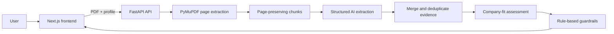

# Architecture

## Why this architecture

- PDF text is extracted locally so page numbers remain stable.
- The model receives bounded chunks rather than an uncontrolled full document.
- Pydantic structured outputs make the API response typed and testable.
- The final recommendation is separated from document extraction.
- Deterministic guardrails prevent an APPLY result when a mandatory requirement is marked missing.
- Mock mode lets the product workflow run without external API calls.

## Current limitations

- no OCR;
- no persistent database;
- no authentication;
- no user correction storage;
- no automated tender discovery;
- page-level rather than bounding-box citations.
